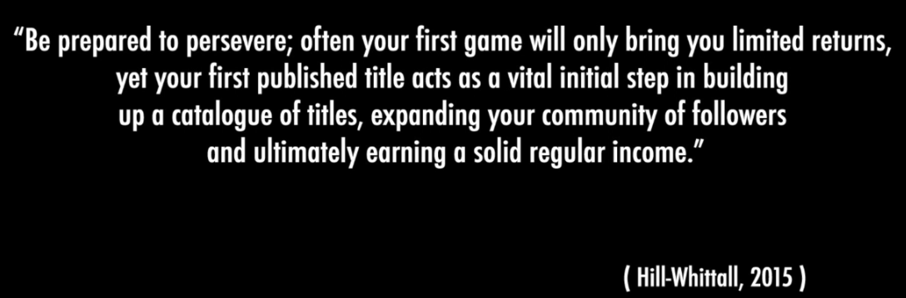

*This post is currently in draft...*

The [IGD720](/tags#ma-game-development) assignment results are in.

I want to focus on one particular bit of feedback from the tutor:

> I really enjoyed reading about your opinion on targeting the market versus making something you feel passionate about. This is a rather controversial topic as we had discussed in previous webinars, as there is supporting evidence that gives credence to both sides of the debate. You began to tease out a fine analysis into this, and appreciate you are currently undecided overall, but what would you say is your conclusion? This is not something I can provide an answer to, unfortunately, but here is a small hint based on my experience in this domain so far: How do you get your game in front of as many people as possible?

Jonathan Blow stumbles upon good designs as he's developing .

Answer the question: How do you get your game in front of as many people as possible?
Make something no-one's seen before, and share the work frequently (devlogs, screenshots, GIF, Twitter #screenshotsaturday, etc). Your niche will start following you. When you get greenlit, they'll start wishlisting you. 
Like Jonathan Blow, you'll have happy accidents along the way to make your game really unique. No amount of research would have told Jonathan Blow to make Braid.

# Bibliography



