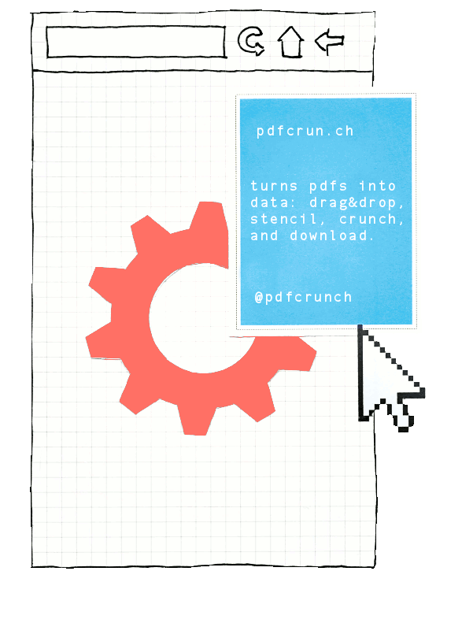
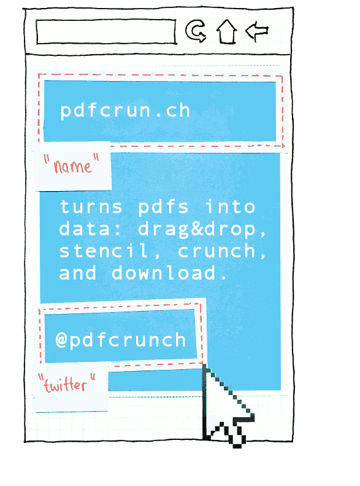

# **pdfcrunch** turns PDFs into data

We've all been there.

You copy/paste a table from a PDF into a spreadsheet, only to spend time cleaning up formatting, whitespace, and misaligned rows and columns.

Skip the Excel gymnastics, and let **pdfcrunch** turn your PDFs into data.

## How does it work?

### 1. Upload

Upload your PDF. It's as simple as drag-and-drop.

### 2. Crunch

We crunch your data for you. Or, you take the reins by drawing and tagging stencils over key areas.

            
### 3. Download
            
Once your PDF has been crunched, download your data bundle.

## What else!?

{:.superbullet}
###  Any size; any layout

Crunch your monthly bank statement, or extract every last detail from that gigabyte-sized research report.

{:.superbullet}
### It's smart

Automatic table detection and header extraction — we give you a baseline stencil to tweak.

In fact, we're working hard on a new V2 deep neural net algorithm to make it the most accurate table detector on the market.

{:.superbullet}
### Your data

Access your crunched data right here as a CSV download, or via an API.

[Sign up now]({{ site.baseurl }}){:.calltoaction}

